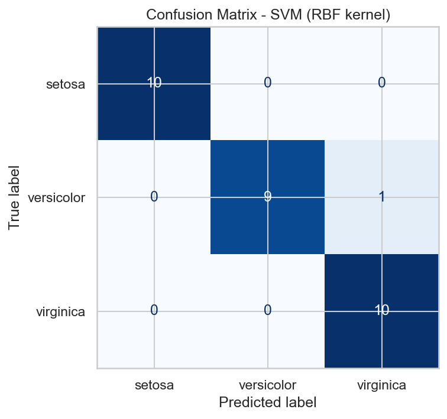
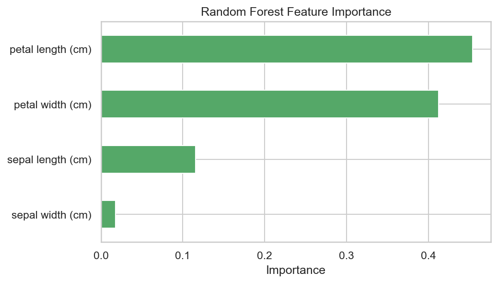

# Iris Species Classification

Predicting the species of an iris flower (*setosa*, *versicolor* or *virginica*) from four measurements: sepal length, sepal width, petal length and petal width. Five classifiers are trained and compared, and the best one is evaluated in detail.

Built as a lab assignment for **TEB3113 Big Data Analytics** at Universiti Teknologi PETRONAS.

[Pairplot of iris features by species](outputs/01_pairplot.png)

## Results

| Model | Test accuracy | 5-fold CV accuracy |
|---|---|---|
| **SVM (RBF kernel)** | **96.7%** | 96.7% ± 3.1% |
| Logistic Regression | 93.3% | 95.8% ± 2.6% |
| K-Nearest Neighbors (k=5) | 93.3% | 96.7% ± 3.1% |
| Decision Tree | 93.3% | 94.2% ± 2.0% |
| Random Forest (200 trees) | 90.0% | 95.0% ± 1.7% |

The SVM classified 29 of the 30 test flowers correctly. Its only mistake was one *versicolor* predicted as *virginica*, the two species whose measurements overlap. *Setosa* was always classified correctly because its petals are far smaller than the other two species'.

<p>
  
  
</p>

**Petal measurements matter most.** In the Random Forest, petal length (45%) and petal width (41%) account for about 87% of feature importance, while sepal width contributes under 2%. The boxplots and correlation heatmap in `outputs/` show the same pattern.

> With only 30 test samples, each misclassification moves accuracy by about 3 points, so the cross-validation scores give a steadier comparison between models than test accuracy alone.

## Pipeline

1. **Load:** the classic Iris dataset (Fisher, 1936) via `sklearn.datasets.load_iris`: 150 samples, 4 features, 3 balanced classes, no missing values.
2. **Explore:** pairplot, correlation heatmap, per-species boxplots and a class-balance chart.
3. **Preprocess:** stratified 80/20 train/test split and standard scaling (fitted on the training set only).
4. **Train:** Logistic Regression, KNN, Decision Tree, Random Forest and SVM.
5. **Evaluate:** test accuracy, 5-fold cross-validation, classification reports, and a confusion matrix for the best model.
6. **Interpret:** Random Forest feature importance.

All randomness is seeded (`random_state=42`), so the results above reproduce exactly.

## Run it yourself

```bash
git clone https://github.com/azrainnn/iris-species-classification.git
cd iris-species-classification
pip install -r requirements.txt
python iris_analysis.py
```

The script prints each step's results to the terminal and saves every chart, plus `model_comparison.csv`, to `outputs/`.

## Project structure

```
├── iris_analysis.py     # full pipeline: EDA → training → evaluation
├── requirements.txt
└── outputs/
    ├── 01_pairplot.png
    ├── 02_correlation_heatmap.png
    ├── 03_boxplots_by_species.png
    ├── 04_class_balance.png
    ├── 05_model_comparison.png
    ├── 06_confusion_matrix_best_model.png
    ├── 07_feature_importance.png
    └── model_comparison.csv
```

## Tech stack

Python · pandas · NumPy · scikit-learn · matplotlib · seaborn

## Team

- Azrain Shawn Bin Ariffin
- Por Jie Hao
- Ikmal Bin Mohd Sofian

Supervised by Ts Dr Nurul Aida Osman.

## Reference

Fisher, R. A. (1936). The use of multiple measurements in taxonomic problems. *Annals of Eugenics, 7*(2), 179–188.
